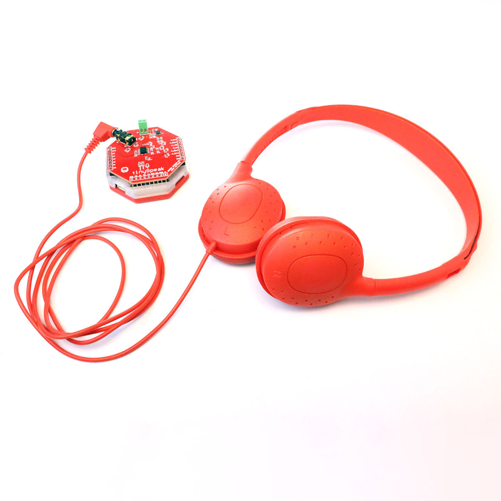
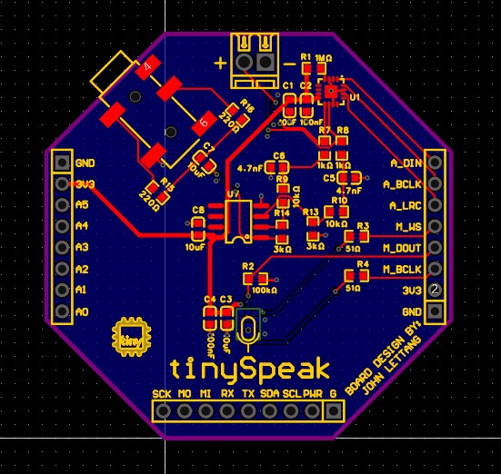
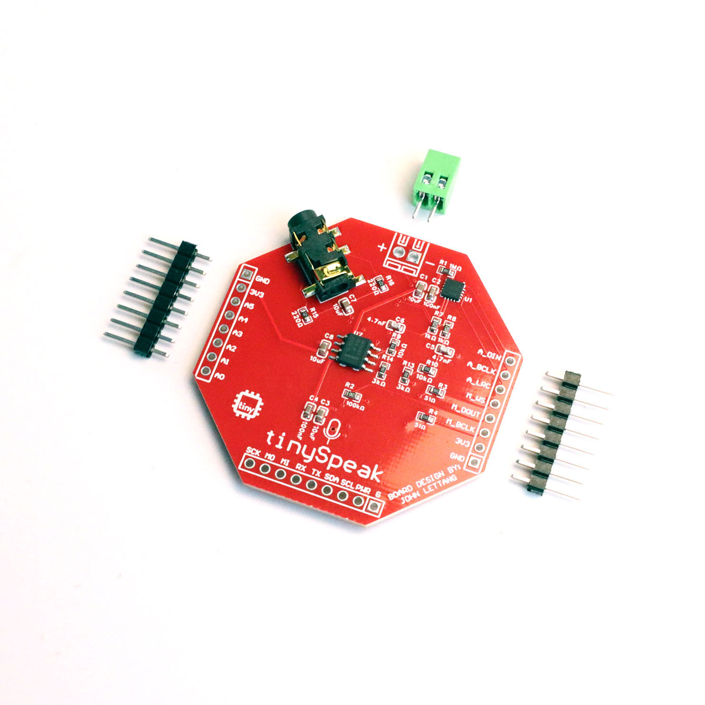
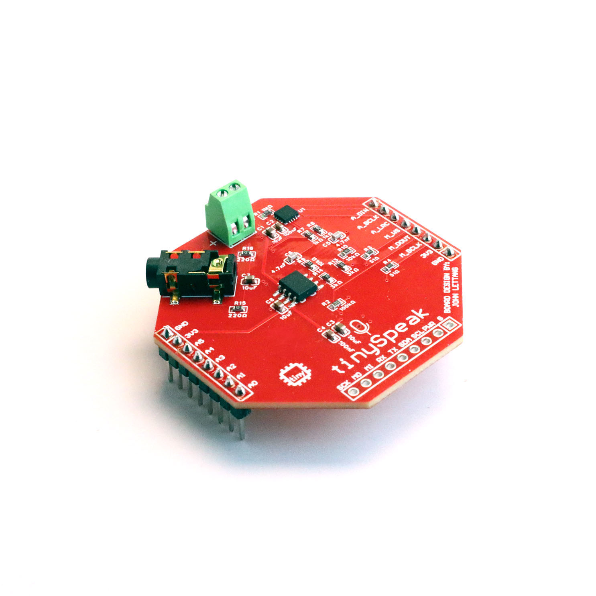
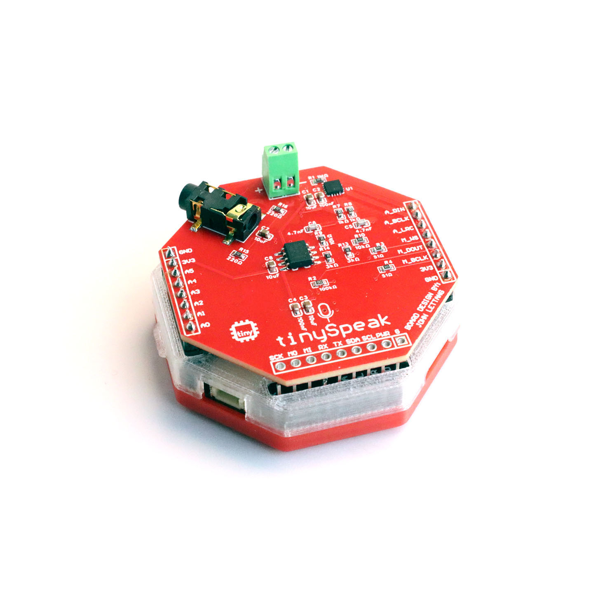

# tinySpeak — Audio Expansion HAT for tinyCore

<div align="center">

[](https://www.gnu.org/licenses/gpl-3.0)
[](https://certification.oshwa.org/us002804.html)
[](https://www.espressif.com/en/products/socs/esp32-s3)


**A full-featured audio I/O board for the [tinyCore](https://github.com/Mister-Industries/tinyCore) ESP32-S3 platform.**

Speaker output, MEMS microphone, headphone jack, SD card, and nine ready-to-flash demo programs — from an MP3 player to a voice-controlled AI assistant.

[Purchase](https://mr.industries) · [Discord](https://discord.gg/hvJZhwfQsF) · [Documentation](https://tinydocs.cc/3_tiny-hats/tinyspeak/)

</div>

---

## Overview



tinySpeak is an expansion HAT that sits on top of the tinyCore ESP32-S3 board and turns it into a complete audio development platform. It provides everything you need to build projects that listen, speak, and play music — without any external wiring.

The board carries an I2S digital amplifier driving a small speaker, an I2S MEMS microphone for voice capture, a 3.5mm headphone jack with a dedicated analog output stage, and a Micro SD card slot for storing audio files. All of this connects to the tinyCore through a set of stacking headers, so there's nothing to breadboard or solder beyond the initial header assembly.

tinySpeak ships with nine demo programs that cover a wide range of audio applications: offline MP3 playback, voice recording, motion-triggered soundboards, a theremin you control by tilting the board, a walkie-talkie that works without WiFi, a browser-based chiptune synthesizer, and three different AI assistant configurations. Each demo is self-contained and ready to flash from the Arduino IDE.

### What's on the Board

The tinySpeak HAT includes an I2S Class-D amplifier (MAX98357A) with an 8-Ohm speaker, an I2S MEMS microphone (SPH0645LM4H-B) for voice input, and a dual op-amp headphone output stage (TLV9062) with a 3.5mm audio jack for listening with headphones.

---

## Pinout

tinySpeak uses the following tinyCore GPIO pins. These are active whenever the HAT is mounted, so avoid assigning them to other peripherals in your own sketches.

### Speaker (MAX98357A — I2S Output)

| Signal | GPIO | Description |
|--------|------|-------------|
| BCLK | 9 | Bit clock |
| LRC | 10 | Left/right clock (word select) |
| DOUT | 8 | Serial data out to amplifier |

### Microphone (SPH0645LM4H-B — I2S Input)

| Signal | GPIO | Description |
|--------|------|-------------|
| SCK | 13 | Bit clock |
| WS | 11 | Word select |
| SD | 12 | Serial data in from microphone |

### Optional Button

| Signal | GPIO | Description |
|--------|------|-------------|
| BTN | RX | Active-low with internal pullup. See [Adding the RX Button](#adding-the-rx-button) below. |

---

## Hardware

### Key Components

| Component | Part Number | Role |
|-----------|-------------|------|
| I2S Amplifier | MAX98357AETE+T | Class-D mono amplifier, drives the onboard speaker directly from I2S digital audio |
| MEMS Microphone | SPH0645LM4H-B | I2S digital microphone for voice recording and speech recognition |
| Dual Op-Amp | TLV9062IDR | Buffers and filters the analog headphone output through the 3.5mm jack |
| Audio Jack | PJ-327A0-SMT | 3.5mm TRS headphone output |

The complete bill of materials with all passives, capacitors, and resistor values is available in [BOM_tinySpeak_PCB1_1_20251130.csv](https://github.com/Mister-Industries/tinySpeak/blob/main/Hardware/Electronics/BOM_tinySpeak_PCB1_1_20251130.csv).

### Schematic (EasyEDA)



The tinySpeak schematic is provided as an EasyEDA project file. EasyEDA is a free PCB design tool created by JLCPCB.

To open the file:
1. Go to [easyeda.com](https://easyeda.com/) and sign in (or create a free account).
2. In the editor, go to **File > Import > EasyEDA (Professional)** and select the `.epro` schematic file from the Hardware folder of this repository.
3. The full schematic will open in the editor where you can inspect the layout (PCB1_1) and wiring (Schematic1_1).

If you prefer to use EasyEDA's desktop application, the same import process works from the **File > Import** menu. The schematic is also viewable in the EasyEDA Pro (STD) client if you have it installed.

### Headphone Output

The 3.5mm jack provides an analog headphone output driven by the TLV9062 dual op-amp. This is a split signal path from the speaker out, but has been amplified to drive headphones. You should disconnect the speaker output while using headphones.

---

## Getting Started

### What You'll Need

To get started with tinySpeak, you need a tinyCore ESP32-S3 board, a tinySpeak HAT (this board), a USB-C cable for programming and power, a Micro SD card (required for most demos — any size works, FAT32 formatted), and the Arduino IDE (2.x or later) installed on your computer. For the AI demos, you will also need a WiFi network and an OpenAI API key, and the ElevenLabs demo additionally requires an ElevenLabs API key.

### Soldering the Headers

tinySpeak connects to tinyCore through stacking pin headers. If your HAT arrived with loose headers (all of them currently ship this way), you'll need to solder them before first use.



Start by inserting the stacking headers into the tinySpeak HAT from the bottom side of the board, so the long pins point downward (these will plug into the tinyCore). The short pins should poke through to the top side of the tinySpeak PCB where you'll solder them. There are three headers, two male 8-pin headers, and one female 9-pin header. Be sure to orient these the right way!

A helpful technique is to first seat the headers loosely into the tinyCore board (without soldering to the tinyCore), then place the tinySpeak HAT on top. This uses the tinyCore as an alignment jig so your headers end up perfectly straight and at the correct spacing. Once aligned, solder the short pins on the top side of the tinySpeak board. Work one pin at each corner first to tack the headers in place, then go back and solder the remaining pins.



After soldering, remove the tinySpeak from the tinyCore, inspect your joints, and then re-seat the HAT firmly. The fit should be snug but not require excessive force.



### Arduino IDE Setup

**Board Configuration**

Make sure you have installed and setup the custom tinyCore library for Arduino, which you can find a tutorial for here: [Setup the Arduino IDE](https://docs.mr.industries/1_get-started/arduino-ide/)

**Required Libraries**

Different demos require different libraries. Install these through the Arduino IDE Library Manager (**Sketch > Include Library > Manage Libraries...**) or by searching in the Libraries tab on the left sidebar:

| Library | Used By | Author |
|---------|---------|--------|
| ESP32-audioI2S | MP3 Player, Recorder, Soundboard, AI demos | schreibfaul1 |
| ArduinoJson | AI Text, AI Voice, AI Voice EL | Benoit Blanchon |
| Adafruit LSM6DS | Soundboard, Theremin | Adafruit |
| Adafruit Unified Sensor | Soundboard, Theremin | Adafruit |
| ESP Async WebServer | Web Synth | ESPAsync |
| AsyncTCP | Web Synth | ESPAsync |

The WiFi, SD, SPI, Wire, Preferences, and esp_now libraries are built into the ESP32 Arduino core and do not need separate installation.

### Uploading Your First Demo

A good first program to try is **tinyMP3Player**, since it has no WiFi or API key requirements. Copy a few `.mp3` files onto your Micro SD card (some have been provided in the repo), insert the card into the tinySpeak slot, open `tinyMP3Player.ino` in the Arduino IDE, and click Upload. Once it finishes flashing, open the Serial Monitor at 115200 baud and you should see your MP3 files listed. Press `p` to start playback.

---

## Adding the RX Button

Several of the demo programs support an optional tactile pushbutton connected to the ESP32's RX pin. This button is used for push-to-talk recording (in the voice and walkie-talkie demos), play/pause and track skip (in the MP3 player), sound triggering (in the soundboard), and mute toggling (in the theremin). The tinySpeak PCB does not have this button included — you solder it yourself if your project needs it.

### Wiring

The button is wired between the **RX** pin and **GND**. No external resistor is needed because all of the demo firmware enables the ESP32's internal pull-up resistor on the RX pin (`pinMode(RX, INPUT_PULLUP)`). When the button is not pressed, the pin reads HIGH. When pressed, the pin is pulled to GND and reads LOW.

If you're connecting an external button with jumper wires (for example, mounting a larger button on an enclosure), run one wire from the button to the RX pin on the tinyCore header and the other wire to any GND pin.

### A Note on the RX Pin

The RX pin doubles as the ESP32's UART receive line, which is used during serial programming. (tinyCore does not normally use these pins, as the ESP32-S3 provides dedicated USB programming pins.) In practice this rarely causes conflicts — the button is open (HIGH) by default and only shorts to GND when pressed, so it doesn't interfere with uploading firmware (as long as you aren't pressing the button).

---

## Demo Programs

tinySpeak ships with nine demo programs, organized here from simplest (no WiFi, no APIs) to most advanced (full AI voice pipelines). Each demo is a single `.ino` file that can be opened and uploaded directly from the Arduino IDE. Additional MP3's have been provided when helpful.

### tinyMP3Player

**[tinyMP3Player.ino](https://github.com/Mister-Industries/tinySpeak/blob/main/Software/Arduino/Examples/tinyMP3Player/tinyMP3Player.ino)**

A straightforward SD card music player. Drop `.mp3` files into the root of your SD card and tinyMP3Player will find and play them in order, automatically advancing to the next track when each one finishes. You can control playback from the Serial Monitor with single-key commands for play/pause, next/previous track, and volume adjustment. If the optional RX button is installed, a single press toggles play/pause and a quick double-press skips to the next track.

This is the best demo to start with, since it requires no WiFi, no API keys, and no microphone — just an SD card with some music on it.

**Requires:** SD card with `.mp3` files · **WiFi:** No · **Libraries:** ESP32-audioI2S

---

### tinyRecorder

**[tinyRecorder.ino](https://github.com/Mister-Industries/tinySpeak/blob/main/Software/Arduino/Examples/tinyRecorder/tinyRecorder.ino)**

A standalone voice recorder that captures audio from the onboard MEMS microphone and saves it as a standard 16-bit 16kHz WAV file on the SD card. Hold the RX button to record and release to stop — the recording is saved to `/recording.wav` on the SD card and can be played back immediately by pressing `p` in the Serial Monitor. The WAV files are standard PCM format, so you can also pull the SD card and open them on any computer.

This demo is a good way to verify that both the microphone and speaker are working correctly before moving on to the more complex programs. It operates entirely offline with no WiFi required.

**Requires:** SD card, RX button (or use `r` command in Serial) · **WiFi:** No · **Libraries:** ESP32-audioI2S

---

### tinySoundboard

**[tinySoundboard.ino](https://github.com/Mister-Industries/tinySpeak/blob/main/Demos/tinySoundboard.ino)**

A motion-triggered soundboard that plays sound effects when you shake the board. It reads the tinyCore's built-in LSM6DSO IMU (accelerometer) to detect a shake gesture, and when the acceleration magnitude exceeds a configurable threshold, it fires off the currently selected sound effect from the SD card. You can also trigger sounds with the RX button or from the Serial Monitor, cycle through different sound files, and adjust the volume.

Load up your SD card with `.mp3` or `.wav` sound effects — air horns, rim shots, laser sounds, whatever you like — and tinySoundboard will pick them all up automatically from the root directory.

**Requires:** SD card with `.mp3`/`.wav` files · **WiFi:** No · **Libraries:** ESP32-audioI2S, Adafruit LSM6DS, Adafruit Unified Sensor

---

### tinyTheremin

**[tinyTheremin.ino](https://github.com/Mister-Industries/tinySpeak/blob/main/Demos/tinyTheremin.ino)**

A motion-controlled musical instrument inspired by the theremin. Tilt the board left and right to change the pitch (200–1000 Hz) and tilt forward and back to change the volume. The audio is generated in real time as a pure sine wave, synthesized sample-by-sample and pushed directly to the speaker over I2S — there are no audio files involved.

The demo auto-calibrates when it boots (hold the board flat and still during startup), and you can recalibrate at any time by pressing `c`. The RX button acts as a mute toggle. Pitch and volume values are printed to the Serial Monitor in a format compatible with the Arduino Serial Plotter, so you can visualize the motion-to-audio mapping in real time.

This is the only demo that doesn't use the Audio library at all — it drives I2S directly using the ESP-IDF new driver API, which makes it a useful reference for anyone who wants to understand raw I2S audio synthesis on the ESP32-S3.

**Requires:** Nothing beyond tinyCore + tinySpeak · **WiFi:** No · **SD Card:** No · **Libraries:** Adafruit LSM6DS, Adafruit Unified Sensor

---

### tinyWalkieTalkie

**[tinyWalkieTalkie.ino](https://github.com/Mister-Industries/tinySpeak/blob/main/Demos/tinyWalkieTalkie.ino)**

A push-to-talk intercom that streams live audio between two or more tinySpeak units using ESP-NOW — Espressif's low-latency peer-to-peer protocol. No WiFi router, no internet connection, and no server are involved. Audio is captured from the microphone at 8kHz, packed into 240-byte ESP-NOW frames, and broadcast to all nearby tinySpeak devices on the same WiFi channel. On the receiving end, incoming packets are written directly into the speaker's I2S DMA buffer for immediate playback.

Hold the RX button to transmit and release to listen. The button debounce logic includes a 150ms hold threshold to prevent accidental transmissions from loose connections, and a 200ms release delay to avoid cutting out mid-sentence from contact bounce. You can cycle through WiFi channels 1–11 by pressing `c` in the Serial Monitor — all units on the same channel will hear each other.

This demo requires two or more complete tinyCore + tinySpeak setups, each with the RX button installed. No SD card is needed.

**Requires:** 2+ tinyCore + tinySpeak units with RX button · **WiFi:** No (ESP-NOW, no router) · **SD Card:** No · **Libraries:** None (WiFi and esp_now are built-in)

---

### tinyWebSynth

**[tinyWebSynth.ino](https://github.com/Mister-Industries/tinySpeak/blob/main/Demos/tinyWebSynth.ino)**

A chiptune synthesizer with a browser-based UI. The ESP32 runs a local web server and WebSocket endpoint. When you connect to its IP address from any device on the same WiFi network, you get a full musical interface in your browser: a live piano keyboard, a two-track melodic step sequencer, and a three-track drum machine with kick, snare, and hi-hat patterns. All audio is generated on the ESP32 itself — the browser is purely a controller.

The audio engine runs five simultaneous channels with selectable waveforms (square, sawtooth, pulse), per-channel envelope control, and a configurable BPM. You can also export your composition as a WAV file to the SD card from the Serial Monitor. Songs are saved in the browser's localStorage so they persist between sessions.

The first time you run this demo, it will ask for your WiFi credentials through the Serial Monitor so it can join your local network and serve the web interface.

**Requires:** SD card (for WAV export), WiFi network · **WiFi:** Yes (local network only, no internet) · **Libraries:** ESP Async WebServer, AsyncTCP

---

### tinyAIText

**[tinyAIText.ino](https://github.com/Mister-Industries/tinySpeak/blob/main/Demos/tinyAIText.ino)**

A text-based AI assistant. Type a question or prompt into the Serial Monitor, and the ESP32 sends it to OpenAI's ChatGPT API (GPT-4o-mini), receives a text response, converts it to speech using OpenAI's TTS API, saves the MP3 to the SD card, and plays it through the speaker. The entire pipeline — text in, voice out — runs on the device with no browser or companion app.

This is the simplest of the three AI demos because it skips the microphone entirely. It's a good starting point if you want to understand the OpenAI API integration before adding voice input.

On first boot, a configuration wizard will walk you through entering your WiFi SSID, WiFi password, and OpenAI API key. These are saved to the ESP32's flash memory using the Preferences library, so you only need to enter them once. Press `c` at any time to reconfigure.

**Requires:** SD card, WiFi, OpenAI API key · **Libraries:** ESP32-audioI2S, ArduinoJson

---

### tinyAIVoice

**[tinyAIVoice.ino](https://github.com/Mister-Industries/tinySpeak/blob/main/Demos/tinyAIVoice.ino)**

A full voice-in, voice-out AI assistant. This demo builds on tinyAIText by adding the microphone to the front of the pipeline. Hold the RX button and speak your question, release the button, and the device runs a three-stage pipeline: your speech is transcribed by OpenAI Whisper (speech-to-text), the transcript is sent to ChatGPT (GPT-4o-mini) for a response, and the reply is spoken aloud using OpenAI's TTS engine. The entire round trip — voice question to voice answer — typically completes in a few seconds.

Audio is recorded to the SD card as a WAV file before being uploaded to the Whisper API, and the TTS response is streamed directly to the SD card as an MP3 before playback. This stream-to-SD approach avoids buffering large audio payloads in the ESP32's limited RAM, which would cause the audio to cut out mid-sentence on longer responses.

If you don't have the RX button installed, you can also toggle recording with the `r` command in the Serial Monitor.

**Requires:** SD card, WiFi, OpenAI API key, RX button recommended · **Libraries:** ESP32-audioI2S, ArduinoJson

---

### tinyAIVoice_EL

**[tinyAIVoice_EL.ino](https://github.com/Mister-Industries/tinySpeak/blob/main/Demos/tinyAIVoice_EL.ino)**

A premium voice assistant that replaces OpenAI's TTS engine with ElevenLabs for higher-quality, more natural-sounding speech synthesis. The pipeline is otherwise identical to tinyAIVoice: hold the button to record, release to process through Whisper (speech-to-text), ChatGPT (intelligence), and finally ElevenLabs (text-to-speech).

ElevenLabs offers a wide variety of voice options and supports voice cloning. The demo defaults to the "Arthur" (cowboy) voice, but you can change the voice ID through the configuration wizard. To find voice IDs, browse the ElevenLabs voice library at [elevenlabs.io/voice-library](https://elevenlabs.io/voice-library) and copy the ID from your chosen voice's page.

The configuration wizard for this demo asks for five values: WiFi SSID, WiFi password, OpenAI API key (for Whisper and ChatGPT), ElevenLabs API key, and ElevenLabs voice ID. All are saved to flash and persist across reboots.

**Requires:** SD card, WiFi, OpenAI API key, ElevenLabs API key, RX button recommended · **Libraries:** ESP32-audioI2S, ArduinoJson

---

## WiFi and API Key Configuration

The AI demos (tinyAIText, tinyAIVoice, tinyAIVoice_EL) and tinyWebSynth all share a similar configuration system built on the ESP32's Preferences library. Your credentials are stored in the onboard flash memory and persist across power cycles and reflashes — you don't need to re-enter them every time you upload new code.

On first boot, if no configuration is found, the demo will automatically launch an interactive setup wizard in the Serial Monitor. It will prompt you for each required field, one at a time. Passwords and API keys are masked with asterisks as you type.

To reconfigure at any time, press `c` in the Serial Monitor. The wizard will show your current values (with keys partially redacted) and let you press Enter to keep any field unchanged, or type a new value to update it.

### Getting an OpenAI API Key

Go to [platform.openai.com/api-keys](https://platform.openai.com/api-keys), sign in or create an account, and generate a new secret key. You will need to add a payment method, but usage costs for these demos are very low — a typical voice assistant conversation costs fractions of a cent.

### Getting an ElevenLabs API Key

Go to [elevenlabs.io](https://elevenlabs.io), create an account, and find your API key in your profile settings. ElevenLabs offers a free tier with a limited number of characters per month, which is plenty for experimenting with the tinyAIVoice_EL demo.

---

## Troubleshooting

**"SD card mount failed"** — Make sure the SD card is inserted fully into the tinySpeak slot and that it's formatted as FAT32. Cards larger than 32GB may need to be reformatted. Try a different card if the problem persists.

**No audio from the speaker** — Check that the tinySpeak headers are fully seated on the tinyCore. Verify the volume is turned up in the demo (most default to volume 21, the maximum for the Audio library). If using the MP3 player or soundboard, make sure your audio files are in the root directory of the SD card and are valid `.mp3` or `.wav` files.

**Microphone not picking up audio** — The MEMS microphone has a small port hole on the PCB. Make sure it isn't blocked or covered. In the tinyRecorder demo, try recording a loud clap or voice close to the board, then play it back to confirm the mic is functional.

**WiFi connection fails** — Double-check your SSID and password by running the config wizard again (`c` in Serial Monitor). The ESP32 supports 2.4GHz networks only — it cannot connect to 5GHz WiFi. Make sure you're connecting to the correct band.

**"HTTP Error 401" from OpenAI** — Your API key is invalid or has expired. Generate a new one at [platform.openai.com/api-keys](https://platform.openai.com/api-keys) and re-enter it with `c`.

**Walkie-talkie units can't hear each other** — Both units must be on the same WiFi channel. Press `c` on each unit's Serial Monitor to cycle channels and make sure they match. ESP-NOW range is similar to WiFi range — about 30–100 meters line-of-sight.

**Audio cuts out mid-sentence in AI demos** — This is usually a RAM issue that the demos already work around by streaming TTS audio to the SD card. If you're modifying the code and experience this, make sure you're not buffering the full HTTP response body in a String before writing to SD.

---

## Repository Structure

```
tinySpeak/
├── Software/Arduino/Examples/
│   ├── tinyMP3Player.ino
│   ├── tinyRecorder.ino
│   ├── tinySoundboard.ino
│   ├── tinyTheremin.ino
│   ├── tinyWalkieTalkie.ino
│   ├── tinyWebSynth.ino
│   ├── tinyAIText.ino
│   ├── tinyAIVoice.ino
│   └── tinyAIVoice_EL.ino
├── Hardware/
│   ├── Electronics/
│   ├── BOM_tinySpeak_PCB1_1_20251130.csv
│   └── Gerber/
├── Assets/
├── LICENSE
└── README.md
```

---

## License

This project is licensed under the **GNU General Public License v3.0** — see the [LICENSE](LICENSE) file for details. You are free to use, modify, and distribute this hardware and software, provided that derivative works are also released under the same license.

---

## Community

Join the MR.INDUSTRIES community to get help, share your projects, and connect with other builders:

[Discord Server](https://discord.gg/hvJZhwfQsF) — Weekly "Office Hours" every Thursday at 4:30 MST with 1-on-1 engineering help via voice chat.

[Bluesky](https://bsky.app/profile/mr.industries) — Follow for project updates and announcements.

For technical support, replacement parts, or bulk orders, contact us at [support@mr.industries](mailto:support@mr.industries).

---

## Acknowledgments

tinySpeak is part of the tinyCore ecosystem by MR.INDUSTRIES. Special thanks to the open-source community and everyone who contributed feedback during development.

The tinyCore platform uses the ESP32-S3 by Espressif Systems. ESP32-audioI2S by schreibfaul1 is used under its original license for audio playback and I2S management across multiple demos.

---

<div align="center">

**Built with 💙 by [MR.INDUSTRIES](https://mr.industries)**

</div>
